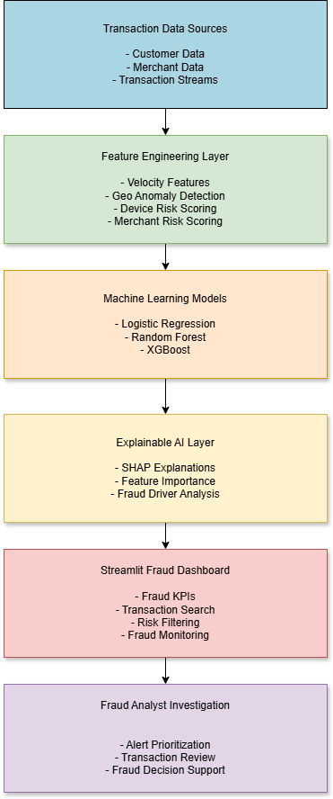
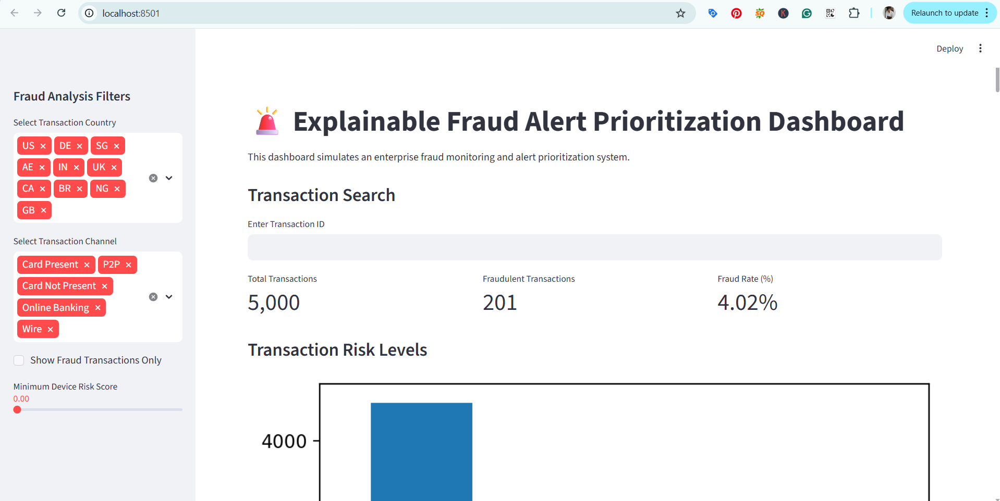
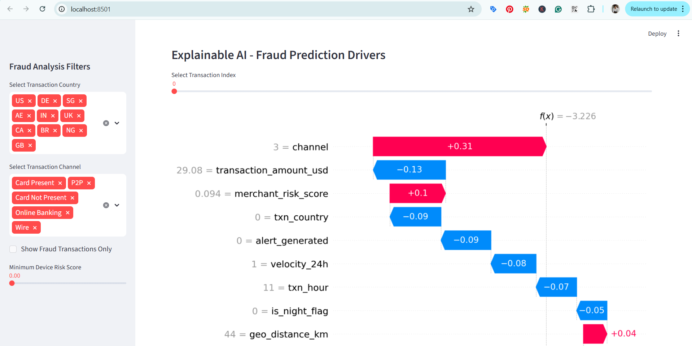
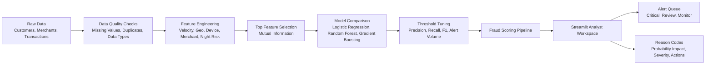

# Explainable Fraud Alert Prioritization System

An end-to-end fraud analytics project inspired by banking investigation workflows. The system scores transactions, prioritizes alerts, explains risk drivers, and gives analysts recommended next actions.

## Project Summary

Banks receive large volumes of transaction alerts, but fraud teams cannot investigate everything with equal urgency. This project builds an explainable machine learning system that helps analysts answer three questions:

1. Which transactions should be reviewed first?
2. Why is the model flagging this transaction?
3. What action should an analyst take next?

The project combines data cleaning, feature engineering, model comparison, threshold tuning, explainability, and a Streamlit fraud analyst workspace.

## Key Outcomes

- Built a complete data-to-dashboard fraud alert prioritization workflow.
- Validated missing values, duplicates, data types, and transaction quality.
- Engineered fraud-specific signals for velocity, geography, device risk, merchant risk, night activity, and amount behavior.
- Selected the top 10 fraud features using mutual information.
- Compared Logistic Regression, Random Forest, and Gradient Boosting models.
- Tuned the review threshold for alert prioritization instead of relying on a default 0.50 cutoff.
- Added local explanations with probability impact, severity, reason codes, and recommended analyst actions.
- Designed a Streamlit fraud analyst workspace with command center KPIs, alert queue, investigation view, scenario testing, and model governance.

## Dashboard Workflow

The Streamlit application is structured like a fraud operations console:

- **Command Center:** queue volume, critical alerts, confirmed fraud, fraud rate, and average risk.
- **Alert Queue:** transaction-level prioritization with `Critical`, `Review`, and `Monitor` tiers.
- **Investigation:** selected transaction profile with prediction, SLA, and reason codes.
- **Scenario Testing:** manual transaction input form for testing new risk scenarios.
- **Model Governance:** top features, model comparison, threshold tuning, and project evidence.

## Model Evidence

Current validation output:

```text
Selected model: Random Forest
Selected review threshold: 0.35
ROC-AUC: 0.6727
Precision: 0.2424
Recall: 0.2000
F1-score: 0.2192
```

The model is intentionally optimized for explainable alert prioritization rather than only raw accuracy. In fraud operations, the goal is to surface higher-risk transactions earlier while keeping the review queue manageable.

## Explainability Layer

For each prediction, the system produces:

- fraud probability
- primary risk driver
- feature-level probability impact
- normal reference value
- severity band
- analyst reason code
- recommended investigation action

Example reason-code logic:

```text
Feature: channel
Risk direction: Increases fraud risk
Severity: High
Recommended action: Check channel-specific fraud pattern and authentication strength.
```

## Screenshots

### System Architecture



### Fraud Dashboard



### Explainability Evidence



## Architecture



More detail: [docs/architecture.md](docs/architecture.md)

## Repository Structure

```text
data/raw/                         Raw customer, merchant, and transaction data
docs/                             Architecture, roadmap, and submission notes
notebooks/01_data_exploration.ipynb
notebooks/02_feature_engineering.ipynb
notebooks/03_model_training.ipynb
notebooks/04_explainability.ipynb
screenshots/                      Project screenshots and visual evidence
src/dashboard.py                  Streamlit analyst workspace
src/fraud_pipeline.py             Reusable modelling and explanation pipeline
src/train_model.py                Command-line model training evidence
src/explainability.py             Example local explanation output
requirements.txt                  Python dependencies
Procfile                          Railway deployment command
```

## Notebooks

- `01_data_exploration.ipynb`: problem statement, data loading, cleaning checks, fraud distribution, initial risk analysis.
- `02_feature_engineering.ipynb`: fraud-specific feature creation and validation.
- `03_model_training.ipynb`: top-10 feature selection, model comparison, threshold tuning, final evaluation.
- `04_explainability.ipynb`: local reason codes, probability impact, severity, and recommended analyst actions.

## Run Locally

```bash
pip install -r requirements.txt
streamlit run src/dashboard.py
```

Then open:

```text
http://localhost:8501
```

## Validate The Model

```bash
python src/train_model.py
```

## Deploy On Railway

1. Push this repository to GitHub.
2. Create a new Railway project from the GitHub repository.
3. Railway installs `requirements.txt`.
4. The `Procfile` runs:

```bash
streamlit run src/dashboard.py --server.port=$PORT --server.address=0.0.0.0
```

## Tech Stack

Python, Pandas, Scikit-learn, Streamlit, Matplotlib, Seaborn, Railway

## Submission Summary

This project was upgraded from a basic fraud dashboard into an explainable fraud alert prioritization system. It now includes a documented data cleaning workflow, fraud feature engineering, top-10 feature selection, model comparison, threshold tuning, local explanation reason codes, and a professional analyst workspace for fraud review.

Full submission wording: [docs/submission_summary.md](docs/submission_summary.md)
