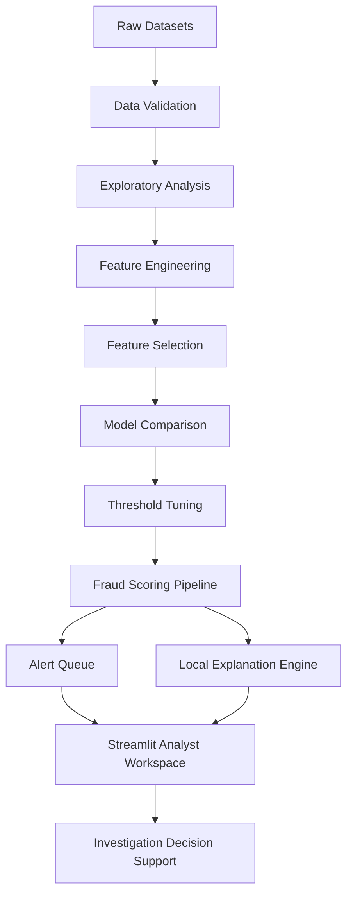

# System Architecture

## Overview

The project is designed as an explainable fraud alert prioritization workflow. It starts with raw transaction data and ends with a fraud analyst workspace that supports triage, investigation, scenario testing, and model governance.

## Architecture Diagram

## Data Layer

Input files:

- `customers.csv`
- `merchants.csv`
- `transactions.csv`

Validation checks:

- missing values
- duplicate rows
- data types
- timestamp parsing
- fraud label distribution

## Feature Engineering Layer

The model uses raw transaction signals and engineered fraud indicators:

- transaction amount
- channel
- country
- transaction hour
- device risk score
- new device flag
- one-hour transaction velocity
- 24-hour transaction velocity
- geographic distance
- merchant risk score
- night transaction flag
- alert generated flag
- combined risk score
- high velocity flag
- geo anomaly flag
- night device risk
- amount velocity ratio

## Feature Selection Layer

Mutual information is used to rank features based on how much they reduce uncertainty about the fraud label.

The final model is intentionally limited to the top 10 features so the dashboard remains explainable and analyst-friendly.

## Modelling Layer

Candidate models:

- Logistic Regression
- Random Forest
- Gradient Boosting

Selection metric:

- ROC-AUC for ranking quality

Operational metrics:

- precision
- recall
- F1-score
- alert volume

## Threshold Tuning Layer

Fraud detection is not only a classification problem. It is also an operations problem. The threshold is tuned to balance:

- fraud capture
- false positives
- investigation workload
- alert queue size

The selected review threshold is used to decide whether a transaction should enter manual investigation.

## Explainability Layer

The local explanation engine compares each transaction against normal reference values and estimates the effect on fraud probability.

Each explanation includes:

- feature name
- input value
- reference value
- probability impact
- risk direction
- severity
- analyst reason
- recommended action

## Application Layer

The Streamlit workspace contains:

- Command Center
- Alert Queue
- Investigation
- Scenario Testing
- Model Governance

This layout is intended to mirror how a fraud analyst would move from high-level monitoring to individual transaction review.
